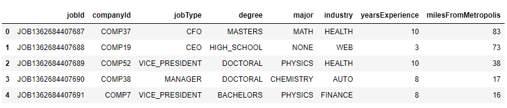
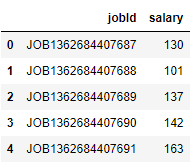
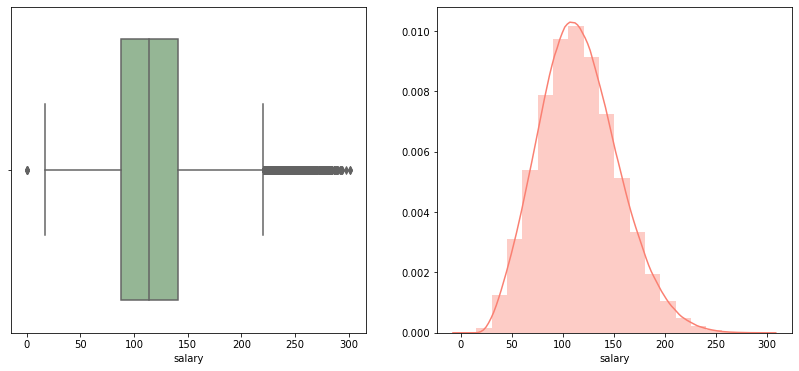
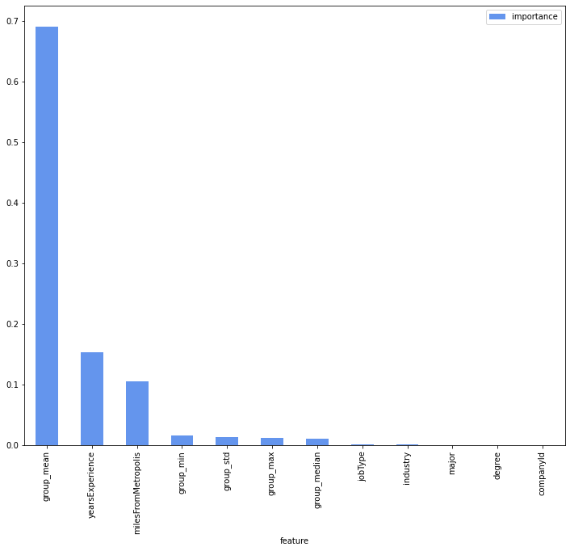

## Predicting Employee Salary
---

- <ins>**Project Requirement**</ins>: HR manager of a company would like to predict salaries for the new job postings by analysing historical hiring data. 

- <ins>*Datasets provided*:</ins>
    - ***train_features.csv***: Each row represents metadata for an individual job posting
    - ***test_features.csv***: Similar to train_features.csv, each row represents metadata for an individual job posting.
    - ***train_salaries.csv***: Each row associates a “jobId” with a “salary”. This is Response/target feature
                        
train_features and test_features                              |  train_salaries (response)
:-------------------------:                                   |:-------------------------:
   |  

| Categorical Features          | Values                                                                                |
|-------------------------------|:---------------------                                                                 |
| companyId                     |    _Distinct values associated to a company_                                          |
| jobType                       |    CFO, CEO, VICE_PRESIDENT, MANAGER, JUNIOR, JANITOR, CTO, SENIOR                    |
| degree                        |    MASTERS, HIGH_SCHOOL, DOCTORAL, BACHELORS, NONE                                    |
| major                         |    MATH, NONE, PHYSICS, CHEMISTRY, COMPSCI, BIOLOGY, LITERATURE, BUSINESS, ENGINEERING|
| industry                      |    HEALTH, WEB, AUTO, FINANCE, EDUCATION, OIL, SERVICE                                |

- <ins>**Distribution of Target variable**</ins>:

- <ins>**Evalulation Metric**:</ins> Mean squared error   

- <ins>**Project acceptance criteria**:</ins>  MSE =< 320
    
- <ins>**Summary**</ins>: 

| Model                       | Mean Squared Error (MSE)|
|----------                   |:-------------:          |
| Gradient Boosting Regressor |    313.09               |
| Random Forest Regressor     |    314.55               |
| Linear Regression           |    358.17               |

We created 3 different models to check the efficacy and choose the one with lowest MSE, in our case it will be **Gradient Boosting Regressor**

- <ins>**Feature Importance**</ins>:

